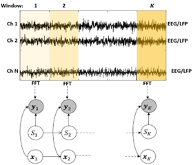
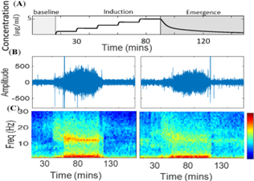
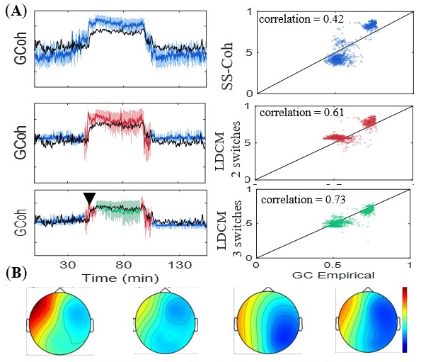

# Latent Dynamical Coherence Model 
In our previous work, we demonstrated a latent dynamical modeling framework called [state-space global coherence](https://github.com/YousefiLab/MDCA/tree/main/State%20Space%20Coherence), which characterizes spectral measures to capture slow-changing dynamics in network-level coherence. In this research, we develop a more general class of the state-space coherence model, that can capture fast and switching changes in the network-level rhythmic dynamics. For this framework, we assume both continuous and discrete latent processes derive the network-level rhythmic dynamics; this modeling assumption, will help us to build a more flexible model structure that can capture sophisticated dynamics present in the neural data. Below figure shows how we combine both continuous and switching dynamics in the model. 

## Data

To assess SS-Coh model, we use EEG data from human patients under general anesthesia. The data set was collected in Emery Brown’s laboratory. 

The complete description of the experimental protocol can be found in [Purdon et al .](https://www.pnas.org/doi/10.1073/pnas.1221180110) . Briefly, ten consenting human volunteers of ages 18-36 years were impaneled for the study approved by the MGH Human Research Committee. For each subject, the induction and emergence from propofol anesthesia were studied by administering a computer-controlled (StanPump) infusion of propofol using the target control protocol based on the Schnider pharmacokinetic-pharmacodynamic model, while the subject executed a behavioral task to identify the points of loss and recovery of consciousness. Neural activity was recorded from 64 channels of EEG at a 250 Hz sampling rate.

Using this dataset, we will study the causal relationship between propofol blood concentration, level of consciousness, and spatio-temporal patterns of functional connectivity. Spectrograms, sliding window GCoh, and LDCM will be applied to identify network modes and their changes associated with loss of consciousness.

## Results
 Figure 1 shows how using of switching mechanism in the LDCM improves the accuracy of estimation in compareison with SS-Coh model.  

### Figure 1 - LDCM model 
**LDCM Application in Anesthesia Data** . **A)** These figures show the inferred GCoh by SS-Coh, LDCM with 2 switches, and LDCM with 3 switches. The time intervals of different switches are shown with blue, red, and greeen colors for the first, second, and third switch, respectively. The black line shows the empirical GCoh. The inferred GCOh using LDCM with 3 switches follows the empirical GCoh with a higher level of accuracy, where we can observe a clear bias in the SS-Coh. The scatter plots on the right, predicted GCoh vs empirical GCoh, also show this bias in SS-Coh, which is compensated as we embed switching process in our modeling of coherence dynamics. In each scatter figure, the correlation is shown. The best score is for LDCM with switches and it shows the better performance of this model. **B)** The scalp heatmap using the dominant eigenvector of CSM at time 45 minutes of experiments derived using empiricial, SS-Coh, LDCM with 2 switches, and LDCM with 3 switches, from left to right. The empirical one shows a strong frontal activity in (Alpha) band through the transition from consciousness to unconsciousness; the result in LDCMs with 2 and  3 switches are significantly close to the empiricial one, where the SS-Coh inferred functional modes do not resemble the empirical one.

