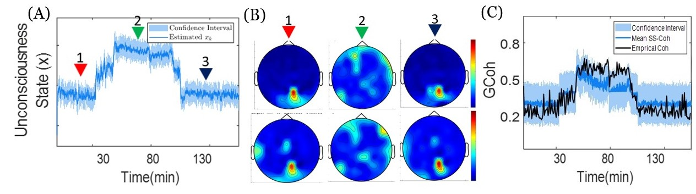
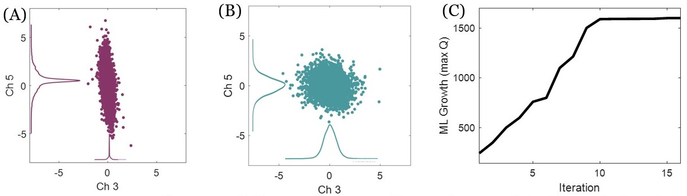

# State Space Coherence

In State Space Coherence (SS-Coh) project, we provide mor robust algorithm for estimating Global Coherence (GCoh). 
To understand some aspects of SS-Coh modelling, you can read [EMBC-2019](https://ieeexplore.ieee.org/abstract/document/8856634) and [bioRxiv-2020](https://www.biorxiv.org/content/10.1101/2020.07.13.199034v1.abstract). In the RO1 proposal, we provide more complete modelling of SS-Coh. 

## Data
To assess SS-Coh model, we use EEG data from human patients under general anesthesia. The data set was collected in Emery Brown’s laboratory. 

The complete description of the experimental protocol can be found in [Purdon et al .](https://www.pnas.org/doi/10.1073/pnas.1221180110). Briefly, ten consenting human volunteers of ages 18-36 years were impaneled for the study approved by the MGH Human Research Committee. For each subject, the induction and emergence from propofol anesthesia were studied by administering a computer-controlled (StanPump) infusion of propofol using the target control protocol based on the Schnider pharmacokinetic-pharmacodynamic model, while the subject executed a behavioral task to identify the points of loss and recovery of consciousness. Neural activity was recorded from 64 channels of EEG at a 250 Hz sampling rate. The anesthesia data is publicly available at the following link: [Anesthesia Data](https://drive.google.com/file/d/1KMCtVw7Pcutf50iWzc-kfaK7_Q5XMJZD/view). 

Using this dataset, we will study the causal relationship between propofol blood concentration, level of consciousness, and spatio-temporal patterns of functional connectivity. Spectrograms, sliding window GCoh, and LDCM will be applied to identify network modes and their changes associated with loss of consciousness.

## Results
In the below we provide some results of SS-Coh model when we run it on the Anesthesia data set. 
In these results, We applied the SS-GCoh model to the anesthesia data (Fig. 1); the inferred results suggest that the functional circuit changes during different phases of the experiment reliably encode underlying consciousness states. 
The inferred functional connectivity using SS-GCoh along with its temporal changes not only corroborates the empirical results in  [Purdon et al .](https://www.pnas.org/doi/10.1073/pnas.1221180110), but also tracks the dynamics with a finer temporal resolution

### Figure 1 - Estimation of SS-Coh 

**SS-GCoh analysis in Alpha band for anesthesia EEG data and its correspondence with empirical results.**  **A)** Inferred unconsciousness state estimation over 2 hours of anesthesia. The latent state represents the unconsciousness level; the state transition is modeled by a random-walk model. **B)** Scalp heat-map of the dominant eigenmodes for 3 different time points during the experiment. The result using SS-GCoh and empirical measures are similar to each other. **C)** Empirical GCoh and inferred GCoh using SS-GCoh. Not only the inferred coherence matches the empirical one; it attains it at a finer temporal resolution. With SS-GCoh, we also derive higher-order statistics of the coherence such as confidence interval. 

#### Figure 2 - Goodness of Fit Analysis 

**Figure 4. Goodness-of-fit analyses and maximum likelihood (ML) curve (A)** Whitening transformation in the anestheisa shown for a pair of channels given initial settings of model parameters. **(B)**  Whitening transformation shown for the pair of channles shown in (A) with trained model. It is clear that the model has captured dynamics present in data. **(C)** ML curve – or maximum of Q function – for different iterations of EM. The curve grows per iteration getting to a local maximum.

## Implementation 
To get similar results, you can run provided code. After running GMM code, you will obtain the same result that we provide in figure 1 and figure 2. 
