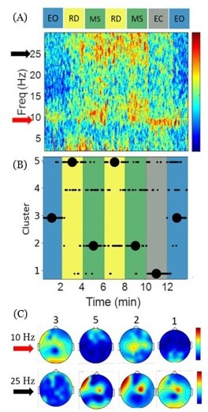

# Switching Dynamic 

In this project, we will evaluate Switching mechanism in the brain by applying Global Coherence Algorithm. 
We evaluate the cluster analysis in one participant. A small number of functional circuits appear at different segments of the experiment; moreover, the same functional circuit emerges when a specific cognitive task is repeated.

## Data
Data was recorded in 14-minute sessions, using a 20-channel dry-electrode EEG, while subjects performed different cognitive tasks. Each session started with eyes open (EO) looking at a screen (2 minutes), which was followed by two rounds of reading (RD) on-screen text (2 minutes), followed by mental serial subtraction (MS) (2 minutes), followed by alternating periods with eyes closed (EC) (2 minutes), and eyes open (2 minutes). 

## Results
In thise section, we try to show different dynamics in the brain would occure when we have are doing different tasks. 
This analysis is utilizing number of clusters based on dominant eigenvectors of the Cross Spectral Matrix (CSM) in Alpha and Beta bands applied to human EEG data from a task-switching experiment.

### Figure 1 - Cluster Analysis based on CSM

**Task switching changes neural circuit engagement.** **A)** Coherogram shows task-dependent elevated synchrony in Alpha and Beta bands. **B)** Cluster indices derived by fitting the Gaussian mixture model to data points defined by stacking dominant eigenvectors of CSM in Alpha and Beta bands. The mixture model with 5 clusters gave the lowest BIC. The black circle shows the mode of indices per each segment of the experiment. Cluster index 3 represents EO, 2 represents MS, 5 represents RD, and 1 matches EC. Cluster index 4 might be another functional circuit present mostly in the MS segment. **C)** Mean of mixtures is projected on the scalp heatmap. The number on the top corresponds to the cluster index. The inferred clusters match the physiology as we observe an elevated occipital synchrony in the Alpha band during EO and frontal Beta band activity during MS segments.

## Implementation 
To get similar results, you can run provided code. After running the main code, you will obtain the same result that we provide in figure 1. 

